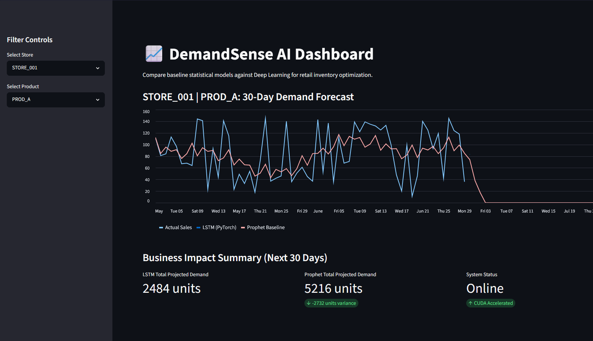

# 📈 DemandSense AI
### Retail Inventory Forecasting & Supply Chain Optimization using Machine Learning

DemandSense AI is an end-to-end machine learning project that forecasts retail demand using both statistical and deep learning approaches. The project compares forecasting models, estimates inventory requirements, and visualizes business impact through an interactive Streamlit dashboard.

The objective is to demonstrate how AI-driven demand forecasting can reduce overstock, minimize stockouts, and improve inventory planning.

---

## 🚀 Features

- Synthetic retail sales data generation
- Complete ETL pipeline using Pandas
- Exploratory Data Analysis (EDA)
- Time-series forecasting with Prophet
- Deep Learning forecasting using PyTorch LSTM
- Interactive Streamlit dashboard
- Business KPI calculations
- Inventory optimization insights
- Modular project architecture

---

## 📊 Dashboard Preview

> Replace this section with screenshots after completing the project.



---

# 🏗️ Project Architecture

```text
Raw Retail Data
       │
       ▼
Data Generation
       │
       ▼
Data Cleaning & ETL
       │
       ▼
Exploratory Data Analysis
       │
       ▼
Feature Engineering
       │
       ├──────────────┐
       ▼              ▼
 Prophet Model     LSTM Model
       │              │
       └──────┬───────┘
              ▼
      Forecast Comparison
              ▼
 Business Metrics & ROI
              ▼
      Streamlit Dashboard
```

---

# 🧠 Machine Learning Pipeline

## 1. Data Engineering

- Synthetic retail sales generation
- Missing value handling
- Date parsing
- Feature creation
- Data normalization

---

## 2. Exploratory Data Analysis

- Sales trends
- Weekly seasonality
- Rolling averages
- Distribution analysis
- Product-level insights

---

## 3. Baseline Forecasting

Implemented using **Meta Prophet**.

Features include:

- Trend modeling
- Weekly seasonality
- Future demand prediction
- Business rule validation
- Forecast clipping

---

## 4. Deep Learning Forecast

Built using **PyTorch LSTM**.

Pipeline includes:

- Sliding window dataset creation
- Sequence modeling
- GPU (CUDA) acceleration
- Multi-epoch training
- Future demand prediction

---

## 5. Business Intelligence Dashboard

Built using **Streamlit**.

Dashboard includes:

- Store selection
- Product filtering
- Forecast visualization
- Inventory recommendations
- Estimated overstock reduction
- Estimated stockout prevention
- ROI metrics

---

# ⚙️ Tech Stack

| Category | Technologies |
|-----------|--------------|
| Language | Python 3.10 |
| Data Processing | Pandas, NumPy |
| Machine Learning | PyTorch, Prophet, Scikit-Learn |
| Visualization | Matplotlib, Plotly |
| Dashboard | Streamlit |
| Environment | Linux, WSL |

---

# 📂 Repository Structure

```text
demandsense-ai/
│
├── data/
│   ├── raw/
│   └── processed/
│
├── notebooks/
│   └── 01_eda.ipynb
│
├── src/
│   ├── data_prep/
│   ├── features/
│   └── models/
│       ├── train_prophet.py
│       └── train_lstm.py
│
├── dashboard/
│   └── app.py
│
├── assets/
│   └── dashboard.png
│
├── requirements.txt
└── README.md
```

---

# 📈 Example Workflow

```text
Generate Data
      ↓
Clean Data
      ↓
EDA
      ↓
Train Prophet
      ↓
Train LSTM
      ↓
Generate Forecast
      ↓
Calculate Business Metrics
      ↓
Visualize Dashboard
```

---

# 🛠 Installation

Clone the repository.

```bash
git clone https://github.com/yourusername/demandsense-ai.git
cd demandsense-ai
```

Install dependencies.

```bash
pip install -r requirements.txt
```

---

# ▶️ Running the Project

Generate synthetic retail data.

```bash
python src/data_prep/generate_raw_data.py
```

Clean the dataset.

```bash
python src/data_prep/clean_data.py
```

Train the Prophet model.

```bash
python src/models/train_prophet.py
```

Train the LSTM model.

```bash
python src/models/train_lstm.py
```

Launch the dashboard.

```bash
streamlit run dashboard/app.py
```

---

# 📌 Future Improvements

- [ ] CSV upload support
- [ ] Real-time inference API
- [ ] Docker deployment
- [ ] PostgreSQL integration
- [ ] Snowflake support
- [ ] Weather and holiday features
- [ ] Multi-product forecasting
- [ ] Attention-based forecasting models
- [ ] CI/CD pipeline
- [ ] Cloud deployment (AWS/Azure/GCP)

---

# 📚 Learning Objectives

This project demonstrates practical experience with:

- Time Series Forecasting
- Deep Learning
- LSTM Networks
- Retail Analytics
- ETL Pipelines
- Feature Engineering
- Streamlit Applications
- Business KPI Analysis
- Python Project Architecture

---

# 🤝 Contributing

Contributions are welcome!

Feel free to fork the repository, open issues, or submit pull requests.

---

# 📄 License

This project is licensed under the MIT License.

---

## ⭐ If you found this project useful, consider giving it a star!
